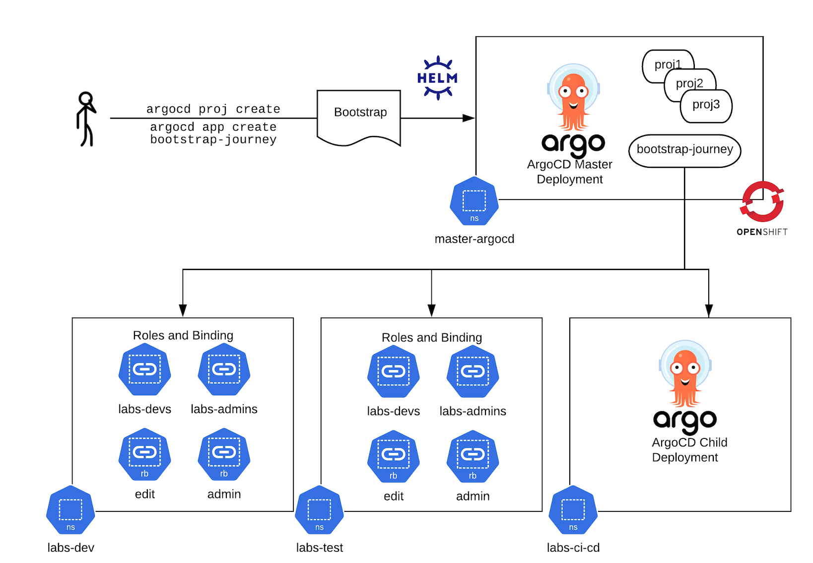

## ArgoCD Master and Child 👩‍👦



1. Deploy a master instance of argocd if you do not already have one. This is deployed into the `master-argocd` project.
```
helm upgrade --install bootstrap -f bootstrap-master/values-bootstrap.yaml bootstrap --create-namespace --namespace labs-bootstrap
```

2. Login to your ArgoCD master and run to create a new project to manage deployments in the Lab's namespace along with the repositories to be allowed pull from:
```bash
argocd login $(oc get route argocd-server --template='{{ .spec.host }}' -n master-argocd):443 --sso --insecure

argocd proj create bootstrap-journey \
  -d https://kubernetes.default.svc,master-argocd \
  -d https://kubernetes.default.svc,labs-ci-cd \
  -d https://kubernetes.default.svc,labs-dev \
  -d https://kubernetes.default.svc,labs-test \
  -d https://kubernetes.default.svc,labs-staging \
  -s https://github.com/rht-labs/ubiquitous-journey.git \
  -s https://github.com/rht-labs/refactored-adventure.git \
  -s https://github.com/redhat-cop/helm-charts.git
```

3. If you require elevated permissions such as project create etc:
```bash
argocd proj allow-cluster-resource bootstrap-journey "*" "*"
```

4. Create your ArgoCD App for `bootrstrap` in your `master-argocd` namespace and sync it!
```bash
argocd app create bootstrap-journey \
  --project bootstrap-journey \
  --dest-namespace master-argocd \
  --dest-server https://kubernetes.default.svc \
  --repo https://github.com/rht-labs/ubiquitous-journey.git \
  --sync-policy automated \
  --path "bootstrap" \
  --values "values-bootstrap.yaml"
```

4. Your new ArgoCD instance should spin up. You can now connect your `ubiquitous-journey` or `example-deployment` to it by following the instructions above